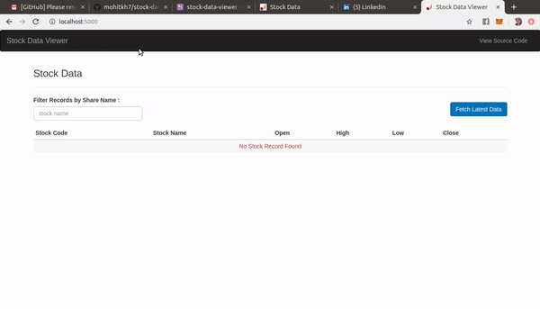

# Stock Data Viewer
A python utility program which scraps and parse the latest stock price from bombay stock exchange(BSE) and displays on user friendly Web interface.

### Demo

Check the [Live Version](https://stock-data-viewer.herokuapp.com/).

### Technologies Used
Python, CherryPy, Redis, AngularJS, HTML, CSS, Javascript, Bootstrap 